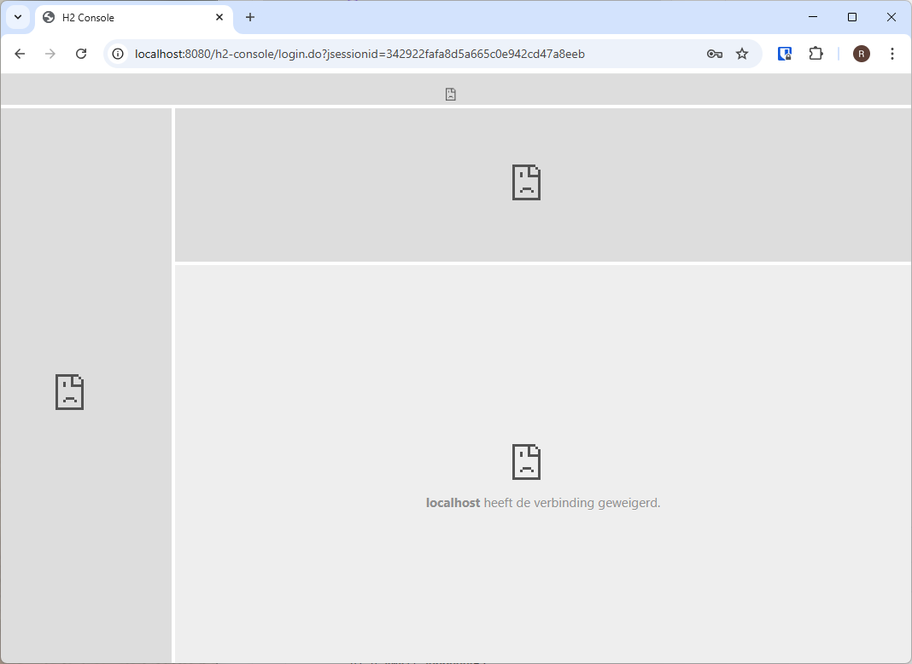

# Fix H2 Console

## Wat gaan we doen?

Als we naar de [H2 console](http://localhost:8080/h2-console) proberen te gaan
terwijl onze applicatie draait zullen we merken dat deze vraagt om in te loggen
(want we gebruiken HTTP basic authenticatie) en dat eens je ingelogd bent de
H2 Console niet correct inlaadt:



In deze stap gaan we ervoor zorgen dat we terug toegang krijgen tot de H2 Console.

## Stappen

### 1. H2 SecurityFilterChain instellen

Spring Security laat toe om niet één, maar meerdere
`SecurityFilterChain`s in te stellen die op andere
paden van toepassing zijn. Daar gaan we nu gebruik van
maken om een specifieke `SecurityFilterChain` te maken
enkel voor de H2 Console.

We baseren hier ons op de officiële documentatie van Spring Data:
https://docs.spring.io/spring-boot/3.5/reference/data/sql.html#data.sql.h2-web-console.spring-security

De resulterende `SecurityFilterChain` ziet er als volgt uit:

```java
@Configuration
@EnableMethodSecurity
public class SecurityConfig {
    @Bean
    @Order(0)
    public SecurityFilterChain h2SecurityFilterChain(HttpSecurity http) throws Exception {
        return http
                .securityMatcher(PathRequest.toH2Console())
                .csrf(csrf -> csrf.disable())
                .headers(headers ->
                    headers.frameOptions(frameOptionsConfig -> frameOptionsConfig.sameOrigin()))
                .build();
    }

    @Bean
    @Order(1)
    public SecurityFilterChain securityFilterChain(HttpSecurity http) throws Exception {
        return http
                // ...
                .build();
    }

    // ...
}
```

Er zijn hier een aantal nieuwigheden die opvallen:

- `@Order(0)` bij `h2SecurityFilterChain` en `@Order(1)` bij `securityFilterChain`. Dit doen we om ervoor te zorgen dat de
  `h2SecurityFilterChain` prioriteit krijgt: alles wat door deze chain gematcht wordt, wordt dan niet behandeld door onze
  normale `securityFilterChain`.
- `.securityMatcher(PathRequest.toH2Console())`: hiermee stellen we in dat deze `SecurityFilterChain` enkel van toepassing
  is op de H2 Console. Wat precies de URL is van de H2 Console kan verschillen op basis van de `spring.h2.console.path` property
  en `toH2Console()` zal ervoor zorgen dat deze altijd juist zal zijn ingesteld, ongeacht het pad.
- `.headers(headers -> headers.frameOptions(frameOptionsConfig -> frameOptionsConfig.sameOrigin()))`: we veranderen de headers
  die Spring Security stuurt en zorgen ervoor dat de `X-Frame-Options` header op `SAMEORIGIN` staat in de plaats van `DENY`.
  Dit zorgt ervoor dat de "frames" (een nogal ouderwetse feature van HTML) waar de H2 Console van gebruik maakt terug werken.

### 2. Extra `SecurityFilterChain` enkel inschakelen als H2 Console enabled is

Omdat we de extra `SecurityFilterChain` enkel nodig hebben als de H2 Console enabled is zullen we deze uitschakelen in alle andere
gevallen. We kunnen dit doen met `@ConditionalOnBooleanProperty`:

```java
@Bean
@Order(0)
@ConditionalOnBooleanProperty(prefix = "spring.h2.console", name = "enabled")
public SecurityFilterChain h2SecurityFilterChain(HttpSecurity http) throws Exception {
    // ...
}
```

Dit zorgt ervoor dat dit component (of *bean*) slechts wordt aangemaakt als de `spring.h2.console.enabled` property op `true` staat,
m.a.w. enkel als de H2 Console enabled is, wordt de `h2SecurityFilterChain` aangemaakt.

### 3. Testen repareren

Als je nu de HTTP-integratietesten probeert te draaien zal je een error opmerken:

```
org.springframework.web.reactive.function.client.WebClientRequestException: No qualifying bean of type 'org.springframework.boot.autoconfigure.h2.H2ConsoleProperties' available
```

`@WebMvcTest` zorgt ervoor dat enkel de nodige controller en andere strikt noodzakelijke classes worden aangemaakt. We hebben er al eerder
voor gezorgd dat `SecurityConfig` aangemaakt werd met `@Import(SecurityConfig.class)`. Nu is ook het probleem dat om de `PathRequest.toH2Console()`
te laten werken we een `H2ConsoleProperties` nodig hebben.

Dit kunnen we oplossen met `@EnableConfigurationProperties`:

```java
@Configuration
@EnableMethodSecurity
@EnableConfigurationProperties(H2ConsoleProperties.class)
public class SecurityConfig {
    // ...
}
```

Wat `ConfigurationProperties` precies zijn en wat we ermee kunnen doen, zullen we nog in een latere stap bekijken.

Het uiteindelijke resultaat vind je in [`SecurityConfig`](./src/main/java/be/ucll/backend2/config/SecurityConfig.java).

## Wat zien we nu?

Je zal merken dat de H2 Console nu terug toegankelijk is.

## Conclusies

- We kunnen meerdere `SecurityFilterChain`s instellen.
- Door een eigen `SecurityFilterChain` voor de H2 Console
  kunnen we ervoor zorgen dat de H2 Console terug werkt.
- Met `@ConditionalOnBooleanProperty` kunnen we ervoor zorgen
  dat componenten enkel worden aangemaakt als een bepaalde
  property een bepaalde waarde heeft.

## Volgende stappen

Als een zwakke wachtwoord hash wordt gebruikt, wordt deze
momenteel zo gelaten in de database. Nu we de H2 Console terug
hebben en dus kunnen zien wat er in de database zit, kunnen
we ervoor zorgen dat wachtwoorden automatisch opnieuw gehasht
worden.
