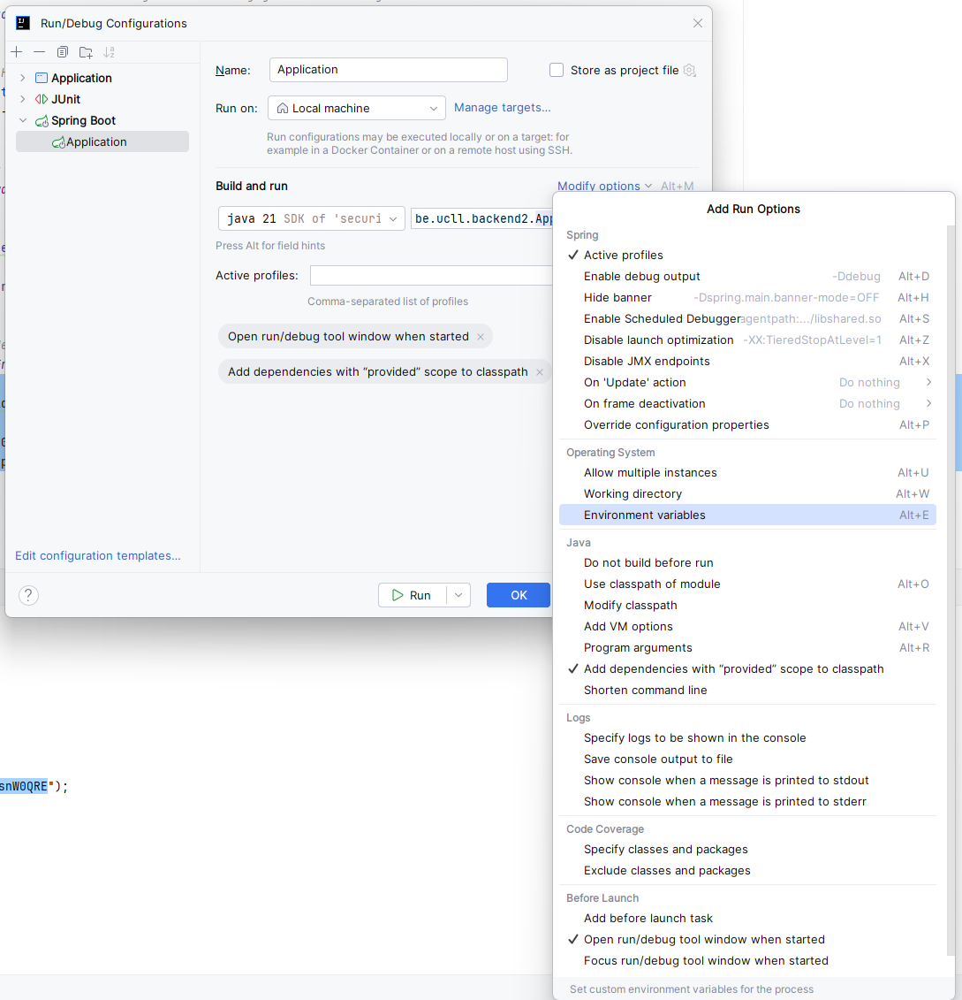
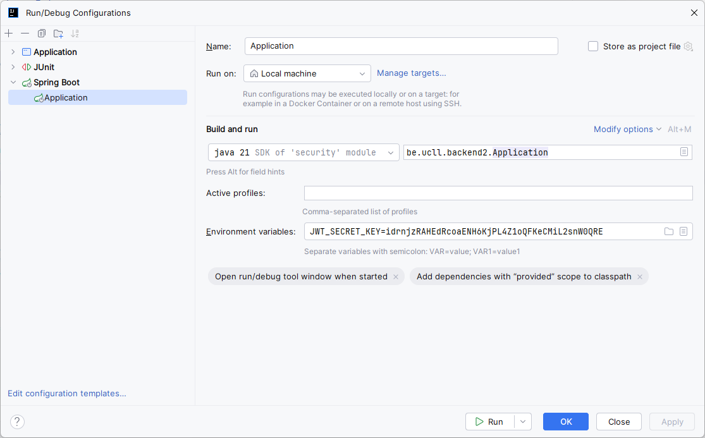

# Eigen properties toevoegen

## Wat gaan we doen?

Deze stap is belangrijk voor de veiligheid: tot nu toe staat de secret key gewoon in de code. Dat
is echter een slecht idee. In deze stap zullen we onze eigen properties definiëren zodat we
(bijvoorbeeld via een environment variabele) deze eigenschappen kunnen instellen bij het deployen.

## Stappen

### 1. Properties definiëren

Eigen properties kan je definiëren als een klasse (of record):

```java
@ConfigurationProperties(prefix = "jwt")
public record JwtProperties(String secretKey,
                            @DefaultValue Token token) {
    public record Token(@DefaultValue("self") String issuer,
                        @DefaultValue("30m") Duration lifetime) {}
}
```

In [`JwtProperties.java`](./src/main/java/be/ucll/backend2/config/JwtProperties.java) vind je deze properties.

We voegen de `@ConfigurationProperties` annotatie toe om deze te markeren als properties.
De `prefix` stelt de prefix van de properties in. Deze properties zullen dus beginnen met
`jwt.`. De namen van de properties worden (tenzij we dit anders instellen) toegekend op basis
van de naam van de parameter. In het geval van `secretKey` zal dit veranderd worden naar `secret-key`.

Je kan default waardes instellen met de `@DefaultValue` annotatie. Merk op dat ook
`@DefaultValue` nodig is bij de `Token` hier, om ervoor te zorgen dat een default token
wordt aangemaakt, en niet `null`.

### 2. Properties registreren

Het definiëren van de properties is niet genoeg: het is ook nodig om deze properties te registreren. Dit hebben
we al eerder gedaan voor `H2ConsoleProperties`. We updaten nu
[`SecurityConfig`](./src/main/java/be/ucll/backend2/config/SecurityConfig.java)
zodat ook onze eigen properties worden ingeladen:

```java
@Configuration
@EnableMethodSecurity
@EnableConfigurationProperties({JwtProperties.class, H2ConsoleProperties.class})
public class SecurityConfig {
    // ...
}
```

### 3. Properties gebruiken

Nu moeten we nog effectief de `JwtProperties` gebruiken. Daarvoor passen we
[`JwtService`](./src/main/java/be/ucll/backend2/service/JwtService.java) aan:

```java
public String generateToken(long id, String emailAddress, Collection<String> roles) {
    final var now = Instant.now();
    // Laad lifetime uit JwtProperties
    final var expiresAt = now.plus(jwtProperties.token().lifetime());
    final var header = JwsHeader
        .with(MacAlgorithm.HS256)
        .type("JWT")
        .build();
    final var claims = JwtClaimsSet.builder()
            // Laad issuer uit JwtProperties
            .issuer(jwtProperties.token().issuer())
            .issuedAt(now)
            .expiresAt(expiresAt)
            .subject(String.valueOf(id))
            .claim("email", emailAddress)
            .claim("scope", String.join(" ", roles))
            .build();
    return jwtEncoder.encode(JwtEncoderParameters.from(header, claims)).getTokenValue();
}
```

En we passen de `secretKey` *bean* in [`SecurityConfig`](./src/main/java/be/ucll/backend2/config/SecurityConfig.java) aan:

```java
@Bean
public SecretKey secretKey(JwtProperties jwtProperties) {
    final var secretBytes = Base64.getUrlDecoder().decode(jwtProperties.secretKey());
    return new SecretKeySpec(secretBytes, "HmacSHA256");
}
```

### 4. Properties instellen

Als we nu properties willen instellen kan dat bijvoorbeeld via `application.yaml`:

```yaml
jwt:
  secret-key: idrnjzRAHEdRcoaENH6KjPL4Z1oQFKeCMiL2snW0QRE
  token:
    lifetime: 30m
    issuer: https://issuer.example.com
```

Het was nu echter onze bedoeling om de secret key *niet* in de source code (en in Git) bij te houden.
Properties kunnen ook via environment variables worden ingesteld: de environment variables zijn in
hoofdletters, en alle punten en streepjes worden vervangen door underscores. We kunnen dus ook de property
`jwt.secret-key` instellen via de environment variabele `JWT_SECRET_KEY`.

In IntelliJ kan je deze als volgt instellen:

1. Ga naar de run configurations door het menu rechtsboven te openen (daar zal typisch `Application` staan):


2. Kies "Edit configurations..."
3. Voeg hier environment variables toe door op "Modify options" te klikken en daarna "Environment variables" te selecteren:



4. Nu kan je de `JWT_SECRET_KEY` environment variabele instellen:



Als je de applicatie nu opstart zal deze secret key gebruikt worden.

## Conclusies

- Met `@ConfigurationProperties` kan je eigen configuration properties instellen
- Met `@DefaultValue` kan je standaardwaarden instellen
- Configuration properties kunnen onder andere ingesteld worden in `application.properties`,
  `application.yaml` en via environment variabelen.

## Volgende stappen

Als je de testen probeert te runnen zal je nu een error opmerken. In de volgende stap
lossen we dit probleem op.
