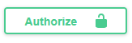
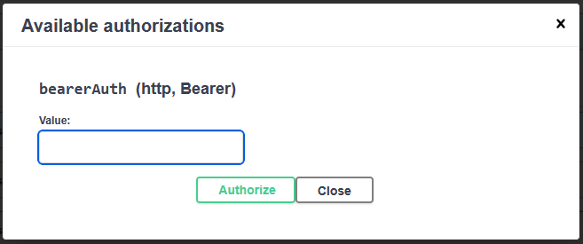

# Swagger

## Wat gaan we doen?

Het zou handig zijn als we ook een Swagger UI hadden. Dit kan perfect met Spring Security,
maar we gaan wel een aantal endpoints moeten toelaten.

## Stappen

### 1. springdoc-openapi toevoegen als dependency

We voegen eerst de volgende dependency toe aan `pom.xml`:

```xml
<dependency>
    <groupId>org.springdoc</groupId>
    <artifactId>springdoc-openapi-starter-webmvc-ui</artifactId>
    <!-- vervang deze door de laatste compatibele versie -->
    <version>2.8.14</version>
</dependency>
```

Let op met de versie: we gebruiken momenteel Spring Boot 3 en Spring Framework 6. springdoc-openapi 3 is enkel compatibel met Spring Boot 4
en Spring Framework 7. We moeten dus versie 2 gebruiken van springdoc-openapi.

### 2. Toegang tot Swagger UI en OpenAPI toelaten

We moeten nu nog toegang geven tot Swagger UI en OpenAPI zonder authenticatie. De `securityFilterChain` in
[`SecurityConfig`](./src/main/java/be/ucll/backend2/config/SecurityConfig.java) wordt dus:

```java
@Bean
@Order(1)
public SecurityFilterChain securityFilterChain(HttpSecurity http) throws Exception {
    return http
            .csrf(csrf -> csrf.disable())
            .sessionManagement(
                    sessionManagement ->
                            sessionManagement.sessionCreationPolicy(SessionCreationPolicy.STATELESS))
            .oauth2ResourceServer(oauth2 -> oauth2.jwt(Customizer.withDefaults()))
            .authorizeHttpRequests(
                    authorizeRequests ->
                            authorizeRequests
                                    .requestMatchers(HttpMethod.POST, "/api/v1/users").permitAll()
                                    .requestMatchers(HttpMethod.POST, "/api/v1/sessions").permitAll()
                                    // Laat OpenAPI toegang toe
                                    .requestMatchers("/v3/api-docs/**").permitAll()
                                    // Laat toegang toe tot Swagger UI
                                    .requestMatchers("/swagger-ui/**", "/swagger-ui.html").permitAll()
                                    .requestMatchers("/error").permitAll()
                                    .anyRequest().authenticated()
            )
            .build();
}
```

### 3. OpenAPI configuratie

Je kan nu via http://localhost:8080/swagger-ui.html de Swagger UI bereiken. Als
je probeert de requests uit te voeren zal je echter merken dat dit niet lukt omdat
je geen token kan meesturen. We zullen dit zo moeten configureren. Daarvoor maken
we een [`OpenAPIConfig`](./src/main/java/be/ucll/backend2/config/OpenAPIConfig.java)
aan:

```java
@Configuration
@OpenAPIDefinition(
        security = @SecurityRequirement(name = "bearerAuth")
)
@SecurityScheme(
        name = "bearerAuth",
        type = SecuritySchemeType.HTTP,
        scheme = "bearer",
        bearerFormat = "JWT"
)
public class OpenAPIConfig {
}
```

## Wat zien we nu?

Nu zal je aan authorize knop zien in de Swagger UI:



Je kan hier dan de token mee instellen:



## Conclusies

- Voor Swagger UI moet je de volgende requests toelaten: alles onder `/swagger-ui` (`/swagger-ui/**`) en `/swagger-ui.html`.
- Voor OpenAPI moet je alles onder `/v3/api-docs` toelaten: `/v3/api-docs/**`
- Met OpenAPI-specifieke annotaties kan je extra informatie instellen, zoals hoe een
  gebruiken moet authenticeren.
